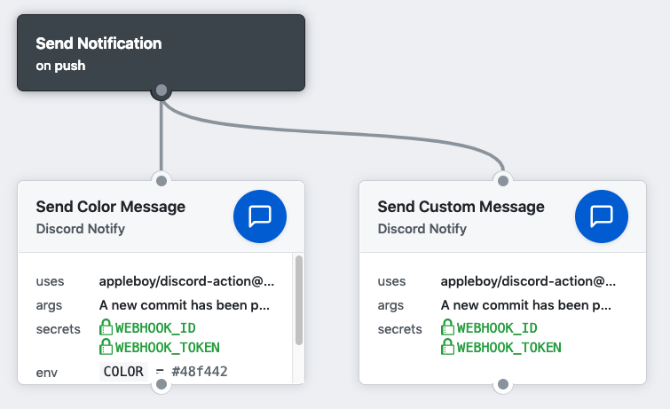

# 🚀 Discord for GitHub Actions

[GitHub Action](https://developer.github.com/actions/) for sending a [Discord](https://discordapp.com/) notification message.


## Usage 

Send custom message as blow

```
action "Send Custom Message" {
  uses = "appleboy/discord-action@master"
  secrets = [
    "WEBHOOK_ID",
    "WEBHOOK_TOKEN",
  ]
  args = "A new commit has been pushed."
}
```



## Secrets

Getting started with [Discord Webhook API](https://discordapp.com/developers/docs/resources/webhook).

* `WEBHOOK_ID`: webhook id of channel.
* `WEBHOOK_TOKEN`: webhook token of channel.
