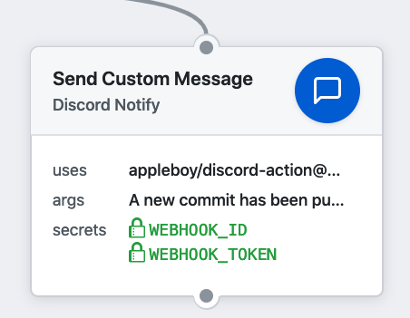

# 🚀 Discord for GitHub Actions

[GitHub Action](https://developer.github.com/actions/) for sending a [Discord](https://discordapp.com/) notification message.



## Features

* [x] Send Multiple Messages
* [x] Send Multiple Files

## Usage

Send custom message as below

```yaml
name: discord message
on: [push]
jobs:

  build:
    name: Build
    runs-on: ubuntu-latest
    steps:
    - uses: actions/checkout@master
    - name: send custom message with args
      uses: appleboy/discord-action@master
      with:
        webhook_id: ${{ secrets.WEBHOOK_ID }}
        webhook_token: ${{ secrets.WEBHOOK_TOKEN }}
        args: The ${{ github.event_name }} event triggered first step.

```

## Environment variables

* USERNAME - Optional. override the default username of the webhook
* AVATAR_URL - Optional. override the default avatar of the webhook
* COLOR - Optional. color code of the embed
* FILE - Optional. send file message

## Example

Send custom message in `message`

```yaml
- name: send message
  uses: appleboy/discord-action@master
  with:
    webhook_id: ${{ secrets.WEBHOOK_ID }}
    webhook_token: ${{ secrets.WEBHOOK_TOKEN }}
    message: The ${{ github.event_name }} event triggered first step.
```

Send the default message.

```yaml
- name: send message
  uses: appleboy/discord-action@master
  with:
    webhook_id: ${{ secrets.WEBHOOK_ID }}
    webhook_token: ${{ secrets.WEBHOOK_TOKEN }}
```

Send the message with custom color and username

```yaml
- name: send message
  uses: appleboy/discord-action@master
  with:
    webhook_id: ${{ secrets.WEBHOOK_ID }}
    webhook_token: ${{ secrets.WEBHOOK_TOKEN }}
    color: "#48f442"
    username: "GitHub Bot"
    message: "A new commit has been pushed with custom color."
```

Send multiple files

```yaml
- name: send message
  uses: appleboy/discord-action@master
  with:
    webhook_id: ${{ secrets.WEBHOOK_ID }}
    webhook_token: ${{ secrets.WEBHOOK_TOKEN }}
    file: "./images/message.png"
    message: "Send Multiple File."
```

## Secrets

Getting started with [Discord Webhook API](https://discordapp.com/developers/docs/resources/webhook).

* `WEBHOOK_ID`: webhook id of channel.
* `WEBHOOK_TOKEN`: webhook token of channel.
